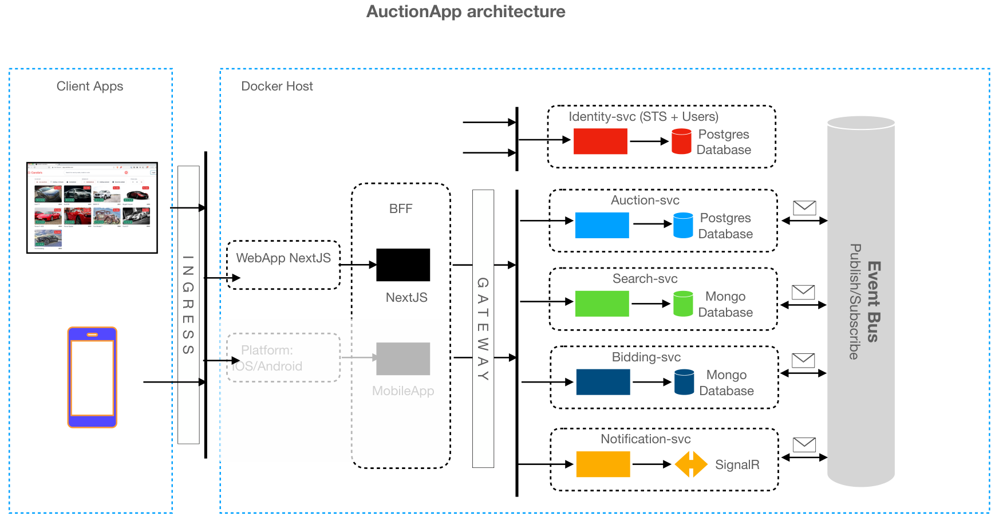

### Car Auction App
Production[^1] ready Car Auctions app which was made while completing Udemy Course for understanding Microservices Architecture using DotNet.

### App Architecture



All the Microservices are made in .NET 9, except for Identity Server which is made in .NET 8 and ideally it is treated as in external, single entity not paired with our application - However, for learning purposes I have paired it with the project.

Technologies used -
- .Net 9 - Microservices
- Duende - Identity Server
- RabitMq - Service Bus
- PostgreSQL - Relational DB (Auction-svc, Identity-svc)
- MongoDB - NoSQL DB (Search-svc, Bidding-svc)
- SignalR - Notifcation Hub
- GRPC - InterCommunication (Auction-svc <-> Bidding-svc)
- Yarp - Gateway
- NextJS/TS - Backend for Frontend & Frontend
- Nginx - Ingress
- Docker - Dockerizing whole app
- XUnit - Unit and Integration Tests for backend
- MKCert-v1.4 - Creating Certificates locally for our app so that it won't show that "Not Secure" errors even when its on HTTP.

> Please go through individual <Name\>Service.csproj file to go through NuGet Packages I've added for various technologies mentioned above.

### Build and Run on your own machine

Requirements - Docker.

```
$> git clone <https/SSH link above>

$> cd Carsties

$> docker compose build

$> docker compose up -d
```
> [!TIP]
> you can use `docker compose build auciton-svc` first and then run `docker compose build` which will help with caching and also show if there's any generic errors with the build 

Once everything is succesfully created and running - visit `http://localhost:3000` which should lead you to app's front page.

> [!WARNING]
> I have used Windows to develop this app I have not tested it on Linux or Mac Machine, unfortunately as of right now I have no idea how well or worse will it work on those.

You can login as Bob or Alice - 
|accounts|usn|passwd|
| ----------- | ----------- | ----------- |
|Bob|bob|Pass123$|
|Alice|alice|Pass123$|

### Features

- Duende-based SSO Signup and Signin options.
- Create Auctions, Update Auction, Delete Auctions.
- Notifications service for auctions created, ended.
- Live Bidding updates for every on-going auction.
- Minimum Reserve price for your auction.
- Timer and Latest Bid shown per auctions on home page.

Feel free to point out any bad practices, mistakes, outdated practices done by me in the following project, I am happy to learn and get better.

[^1]: The app is Production Ready but ofcourse, All of this is just a learning outlet so some of the best in class practices (especially related to Security and few other things) have been compromised for convinience, so when I say this is Production ready please take it with a grain of salt.